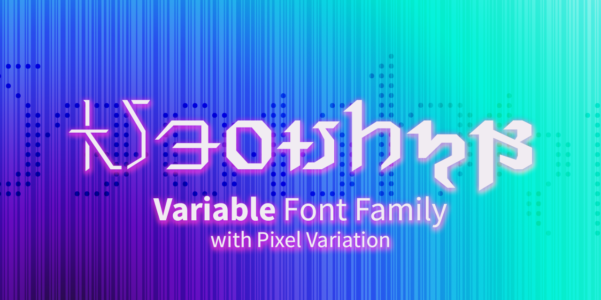

# NeonSky Variable Font Family
 

[简介](README_CN.md)

 

A [Variable font](https://web.dev/variable-fonts/) family inspired by the city _Solution Nine_ in _FINAL FANTASY XIV_.

The design of NeonSky features a geometric, futuristic and Sci-Fi look.

The font has **two** variable axes:

- **Weight** (100-900): Thin – Black
- **Width** (100-200): Regular – Ultra Expanded

and **three** styles:

- Solid
- Stencil
- [Pixel](https://github.com/karaipsum/NeonSky-Font/releases/tag/v1.000-p) (new!!)

The static font files are generated via interpolation.

## Preview

Try the interactive variable font demo page [here](https://karaipsum.github.io/neonsky-demo.html)!

> It's my first time doing web development. I feel very shameful that I borrowed a lot of design and script snipet from the [demo page](https://demos.tyfromtheinternet.com/leaguemonovariable/) of [League Mono](https://github.com/theleagueof/league-mono). I would not be able to make this demo page without this reference. My sincere appreciation here.

## Opentype Features

The features listed below can be tested on the interactive demo page.

### Fraction `frac`, `numr`, `dnom`

See [spec note](https://learn.microsoft.com/en-us/typography/opentype/spec/features_fj#frac)

### Tabular Figures `tnum`

See [spec note](https://learn.microsoft.com/en-us/typography/opentype/spec/features_pt#tnum)

### Oldstyle Figures `onum`

See [spec note](https://learn.microsoft.com/en-us/typography/opentype/spec/features_ko#onum)

### Case-Sensitive Forms `case`

See [spec note](https://learn.microsoft.com/en-us/typography/opentype/spec/features_ae#case)

### Stylistic Alternates `salt`

See [spec note](https://learn.microsoft.com/en-us/typography/opentype/spec/features_pt#salt)

## Reference

See [Augmented Postulated Proto-Alphabet](https://github.com/karaipsum/Postulated-Proto-Alphabet)

Special thanks to [Celes](https://club.huijiwiki.com/wiki/%E7%89%B9%E6%AE%8A:%E9%A9%BE%E9%A9%B6%E5%AE%A4#/user/45979/main)（[@时与悠可](https://weibo.com/u/3506214112)）for datamining and reference pictures.

## License

All company, product, and system names mentioned herein are trademarks or registered trademarks of their respective companies.

The font NeonSky is released under [SIL Open Font License v1.1](https://openfontlicense.org/), with Reserved Font Name "NeonSky" and "NeonSky Stencil".
